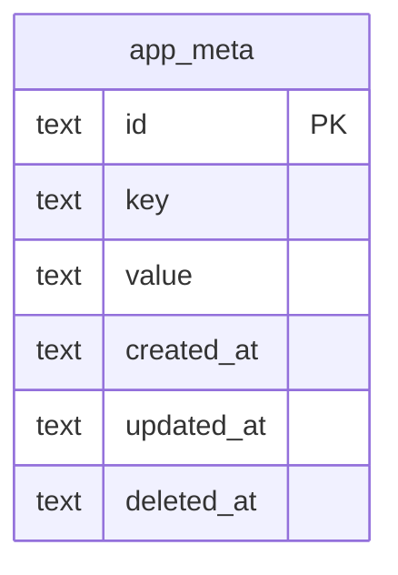

# ERD — generated

Source: `mobile/drizzle/meta/0000_snapshot.json`. Regenerate with `node scripts/docs/gen-data-model.mjs`.

```mermaid
erDiagram
  app_meta {
    text id PK
    text key
    text value
    text created_at
    text updated_at
    text deleted_at
  }
```
