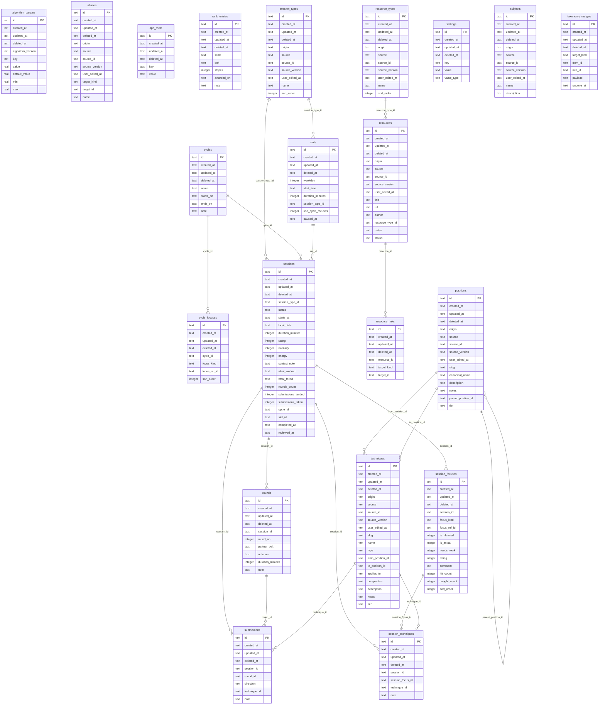

# ERD — generated

Source: `mobile/drizzle/meta/0001_snapshot.json`. Regenerate with `node scripts/docs/gen-data-model.mjs`.

```mermaid
erDiagram
  algorithm_params {
    text id PK
    text created_at
    text updated_at
    text deleted_at
    text algorithm_version
    text key
    real value
    real default_value
    real min
    real max
  }
  aliases {
    text id PK
    text created_at
    text updated_at
    text deleted_at
    text origin
    text source
    text source_id
    text source_version
    text user_edited_at
    text target_kind
    text target_id
    text name
  }
  app_meta {
    text id PK
    text created_at
    text updated_at
    text deleted_at
    text key
    text value
  }
  cycle_focuses {
    text id PK
    text created_at
    text updated_at
    text deleted_at
    text cycle_id
    text focus_kind
    text focus_ref_id
    integer sort_order
  }
  cycles {
    text id PK
    text created_at
    text updated_at
    text deleted_at
    text name
    text starts_on
    text ends_on
    text note
  }
  positions {
    text id PK
    text created_at
    text updated_at
    text deleted_at
    text origin
    text source
    text source_id
    text source_version
    text user_edited_at
    text slug
    text canonical_name
    text description
    text notes
    text parent_position_id
    text tier
  }
  rank_entries {
    text id PK
    text created_at
    text updated_at
    text deleted_at
    text scale
    text belt
    integer stripes
    text awarded_on
    text note
  }
  resource_links {
    text id PK
    text created_at
    text updated_at
    text deleted_at
    text resource_id
    text target_kind
    text target_id
  }
  resource_types {
    text id PK
    text created_at
    text updated_at
    text deleted_at
    text origin
    text source
    text source_id
    text source_version
    text user_edited_at
    text name
    integer sort_order
  }
  resources {
    text id PK
    text created_at
    text updated_at
    text deleted_at
    text origin
    text source
    text source_id
    text source_version
    text user_edited_at
    text title
    text url
    text author
    text resource_type_id
    text notes
    text status
  }
  rounds {
    text id PK
    text created_at
    text updated_at
    text deleted_at
    text session_id
    integer round_no
    text partner_belt
    text outcome
    integer duration_minutes
    text note
  }
  session_focuses {
    text id PK
    text created_at
    text updated_at
    text deleted_at
    text session_id
    text focus_kind
    text focus_ref_id
    integer is_planned
    integer is_actual
    integer needs_work
    integer rating
    text comment
    integer hit_count
    integer caught_count
    integer sort_order
  }
  session_techniques {
    text id PK
    text created_at
    text updated_at
    text deleted_at
    text session_id
    text session_focus_id
    text technique_id
    text note
  }
  session_types {
    text id PK
    text created_at
    text updated_at
    text deleted_at
    text origin
    text source
    text source_id
    text source_version
    text user_edited_at
    text name
    integer sort_order
  }
  sessions {
    text id PK
    text created_at
    text updated_at
    text deleted_at
    text session_type_id
    text status
    text starts_at
    text local_date
    integer duration_minutes
    integer rating
    integer intensity
    integer energy
    text context_note
    text what_worked
    text what_failed
    integer rounds_count
    integer submissions_landed
    integer submissions_taken
    text cycle_id
    text slot_id
    text completed_at
    text reviewed_at
  }
  settings {
    text id PK
    text created_at
    text updated_at
    text deleted_at
    text key
    text value
    text value_type
  }
  slots {
    text id PK
    text created_at
    text updated_at
    text deleted_at
    integer weekday
    text start_time
    integer duration_minutes
    text session_type_id
    integer use_cycle_focuses
    text paused_at
  }
  subjects {
    text id PK
    text created_at
    text updated_at
    text deleted_at
    text origin
    text source
    text source_id
    text source_version
    text user_edited_at
    text name
    text description
  }
  submissions {
    text id PK
    text created_at
    text updated_at
    text deleted_at
    text session_id
    text round_id
    text direction
    text technique_id
    text note
  }
  taxonomy_merges {
    text id PK
    text created_at
    text updated_at
    text deleted_at
    text target_kind
    text from_id
    text into_id
    text payload
    text undone_at
  }
  techniques {
    text id PK
    text created_at
    text updated_at
    text deleted_at
    text origin
    text source
    text source_id
    text source_version
    text user_edited_at
    text slug
    text name
    text type
    text from_position_id
    text to_position_id
    text applies_to
    text perspective
    text description
    text notes
    text tier
  }
  cycles ||--o{ cycle_focuses : "cycle_id"
  positions ||--o{ positions : "parent_position_id"
  resources ||--o{ resource_links : "resource_id"
  resource_types ||--o{ resources : "resource_type_id"
  sessions ||--o{ rounds : "session_id"
  sessions ||--o{ session_focuses : "session_id"
  sessions ||--o{ session_techniques : "session_id"
  session_focuses ||--o{ session_techniques : "session_focus_id"
  techniques ||--o{ session_techniques : "technique_id"
  session_types ||--o{ sessions : "session_type_id"
  cycles ||--o{ sessions : "cycle_id"
  slots ||--o{ sessions : "slot_id"
  session_types ||--o{ slots : "session_type_id"
  sessions ||--o{ submissions : "session_id"
  rounds ||--o{ submissions : "round_id"
  techniques ||--o{ submissions : "technique_id"
  positions ||--o{ techniques : "from_position_id"
  positions ||--o{ techniques : "to_position_id"
```
